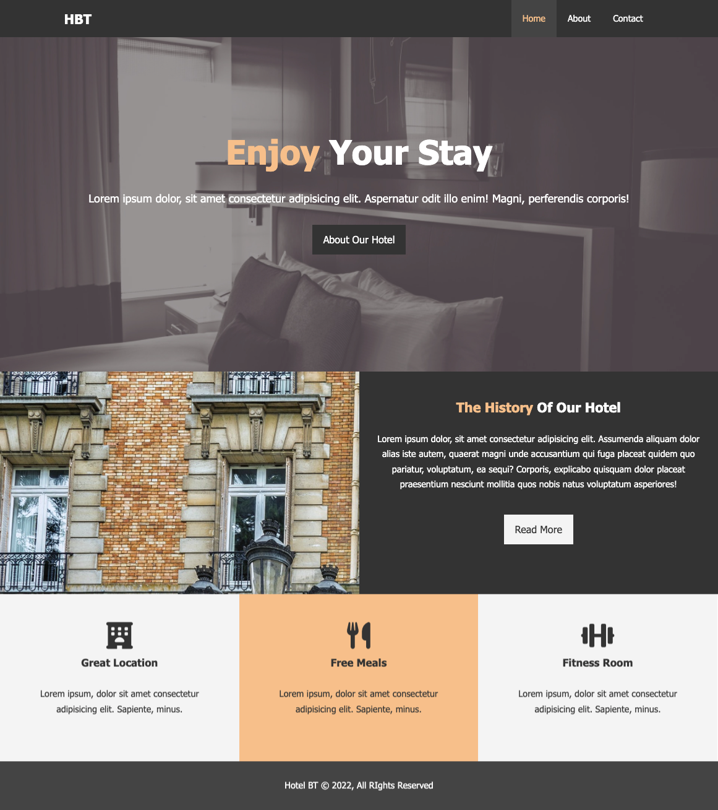

# Hotel-Website

## Overview

A website designed for hotels, Hotel Website (HW) was built using vanilla HTML and CSS, utilizing semantic HTML elements to increase accessibility and make it easier for the developers to follow along.

This site consists of a three main pages:

- Home
- About
- Contact

The homepage features three main sections - showcase, history, and hotel features.

The about page contains a history section and testimonials.

The contact page contains a form.

Project icons provided by [Font Awesome](https://fontawesome.com/)
